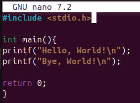

# PR2

## Завдання 2.1
### Існує проблема, яка має назву Year 2038 problem, яка виражається в тому, що в 2038 році, всі 32-бітні системи у змінниій time_t вичерпають к-сть секунд (2,147,483,647) з моменту 1 січня 1970 року. Якщо коротко, то в 2038 році пройде більше секунд, ніж може в собі вмістити time_t на 32-бітних чичтемах (але не на 64-бітних!). І завдання знайти в секундах, скільки залишилося часу до цього "фінально-фатального" дня для 32-бітних.

## Завдання 2.2
### Створили програму Hello World!

Перевіримо її через ls -l та size

### Створимо там масив із 1000 int

### Знову проведемо операцію з ls -l та size
### Як ми бачимо, у наз значно збільшився bss, що означає, що ми маємо багато неоголошених змінних, які представляє собою наш масив int

### Тепер присвоїмо для нашого масиву хоча б одну змінну, що дозволить прибрати його із сегменту bss

### Після цього, додамо локальну функцію, де оголосимо великий масив та присвоїмо йому певну змінну.
### Зробимо вже відому нам перевірку через ls -l та size.

### Як ми бачимо, ми не отримали якусь зміну в сегменті bss, проте отримали приріст значень у сегменті text, адже всі функції та їх вміст займають саме ці сегменти
### Якщо глобальна змінна не ініціалізована, то комп'ютер запише її як bss, проте при ініціалізації, вона записується в сегмент data

### При компіляції у режимі debug, всі невикористані змінні зберігаються, так само, як і будь-який інший, "мертвий", код. За рахунок цього, розмір сегментів переважно залишається, як є
### А от при компіляції в режимі оптимізації, компілятор прибирає все, що не є, або не може бути задіяним задля зменшення коду. Це варто враховувати при програмуванні складних схем в мікроконтролерах, типу багатопоточності, різних типів взаємодії в коді, де є змінні, які компілятор може вважати невикористаними. Загалом, це зменшить розмір сегметнів) 

## Завдання 2.3
### Метою виконання цього завдання є розуміння розташування різних сегментів всередині програми
### Трошки модифікувавши наданий нам код шляхом додавання різних типів даних та виведення їх позиції в пам'яті, можемо детально визначити де знаходяться, які сегменти:

### До речі, в Linux відлік (а відповідно й ієрархія) даних починається з кінцевих значень в пам'яті (0x000000000000 - остання комірка) 

## Завдання 2.4
### Для початку повторимо програму, яка надана в прикладі та запустимо її:

### Як ми бачимо, під час запуску ми отримаємо адресу кожної змінної з кожної функції, які запускаються в конкретному порядку, відповідно до нашого графу

### Давайте проведемо дослідження gdb та gstack:
Дізнаємося pid (Proccess ID) для нашого скомпільованого виконавчого файлу:

Через те, що gstack, так само, як і pstack не працюють на моїй версії Ubuntu:

Скористаємося gdb для кожного pid:

### Як ми бачимо, при викорстанні gdb, ми не можемо отримати стек, оскільки gdb не може побачити бібліотеку continue.c попри те, що всі необхідні пакети було вже встановлено.

## Завдання 2.5
### Чи можна обійтися в процедурі виконання програм використовуючи лише стек, без pid (proccess id).
### Моя відповідь - ні, не можна. Попри те, що я не дуже зрозумів, як подібна структура взагалі може працювати без pid, але я припускаю, що мається на увазі послідовний запис інструкцій у рядок, що може призвести до нелінійності та нелогічності у процесі виконання комп'ютером певного переліку функцій.

### Приклад:
`main:`
`    mov eax, 1;` виконуємо дію (1)
`    call func;` //виклик функції(2)
`    mov ebx, 2;` // повернення до адреси, записаної у вершину стеку (5)

`func:`
`    mov eax, 5;` //виконуємо дію (3)
`    ret;`       //отримуємо команду на повернення (4)

### Отже, без використання pid, вказівник буде йти прямолінійно вздовж коду та виконувати команди непрямолінійно, з боку логіки процесу!

## Завдання 2.6 (12 Варіант)

### Згідно з моїм варіантом, моїм завданням було створити зчитувач elf файлів

`#include <stdio.h>
#include <stdlib.h>
#include <unistd.h>
#include <elf.h>
#include <sys/mman.h>
#include <fcntl.h>
#include <string.h>

void die(const char *msg) {
    perror(msg);
    exit(1);
}

void load_elf_file(const char *elf_filename) {
    // open the ELF file
    int elf_fd = open(elf_filename, O_RDONLY); //opening for READ ONLY
    if (elf_fd == -1) { //check for errors
        die("Error opening ELF file");
    }

    // Read the ELF header
    Elf64_Ehdr elf_header; //read ELF header into elf_header structure
    if (read(elf_fd, &elf_header, sizeof(elf_header)) != sizeof(elf_header)) {
        die("Error reading ELF header");
    }

    // Verify ELF magic number, which is firs 4 bytes what verify whis file as elf (7f 45 4c 46)
    if (memcmp(elf_header.e_ident, ELFMAG, SELFMAG) != 0) {
        // elf_header.e_ident - is header of current elf file
        // ELFMAG - is constant of "magic" elf num
        // SELFMAG - standart lenght of "magic" elf num
        fprintf(stderr, "Not a valid ELF file!\n");
        close(elf_fd);
        return;
    }

    printf("Loaded ELF file: %s\n", elf_filename);
    printf("ELF Type: "); 
    switch (elf_header.e_type) { //take current elf type
        case ET_EXEC:
            printf("Executable\n");
            break;
        case ET_DYN:
            printf("Shared Object\n");
            break;
        default:
            printf("Unknown\n");
            break;
    }

    // Read Program Headers
    lseek(elf_fd, elf_header.e_phoff, SEEK_SET);
    //lseek (int ft, off_t offset, int whence); - to move file poinetr
    // ft - file num
    // offset - how many bytes from whence
    // whence - reading start
    Elf64_Phdr *program_headers = malloc(elf_header.e_phentsize * elf_header.e_phnum);
    if (program_headers == NULL) {
        die("Error allocating memory for program headers");
    }

    if (read(elf_fd, program_headers, elf_header.e_phentsize * elf_header.e_phnum) !=
        elf_header.e_phentsize * elf_header.e_phnum) {
        die("Error reading program headers");
    }

    // Load segments into memory
    for (int i = 0; i < elf_header.e_phnum; i++) {
        Elf64_Phdr *ph = &program_headers[i];

        if (ph->p_type == PT_LOAD) {  // We are only interested in loadable segments
            printf("Loading segment %d: Offset=0x%lx, VAddr=0x%lx, Filesz=0x%lx, Memsz=0x%lx\n",
                   i, ph->p_offset, ph->p_vaddr, ph->p_filesz, ph->p_memsz);

            // Allocate memory for the segment using mmap
            void *segment_memory = mmap((void *)ph->p_vaddr, ph->p_memsz,
                                        PROT_READ | PROT_WRITE, MAP_PRIVATE | MAP_ANONYMOUS,
                                        -1, 0);
            if (segment_memory == MAP_FAILED) {
                die("Error allocating memory for segment");
            }

            // Read the segment data into memory (from the file)
            lseek(elf_fd, ph->p_offset, SEEK_SET);
            if (read(elf_fd, segment_memory, ph->p_filesz) != ph->p_filesz) {
                die("Error reading segment into memory");
            }

            // If the segment size is larger than the file size, zero the rest of the segment
            if (ph->p_memsz > ph->p_filesz) {
                memset((char *)segment_memory + ph->p_filesz, 0, ph->p_memsz - ph->p_filesz);
            }

            printf("Segment loaded into memory at address 0x%lx\n", (unsigned long)segment_memory);
        }
    }

    // Now that segments are loaded, we would normally jump to the entry point,
    // but we can’t execute this in a simple example. You'd need further steps to
    // execute the entry point (e.g., `exec` or manual jump).
    printf("Loaded ELF entry point: 0x%lx\n", elf_header.e_entry);

    // Clean up
    free(program_headers);
    close(elf_fd);
}

int main(int argc, char *argv[]) {
    if (argc != 2) {
        fprintf(stderr, "Usage: %s <elf file>\n", argv[0]);
        return 1;
    }

    load_elf_file(argv[1]);

    return 0;
}`
